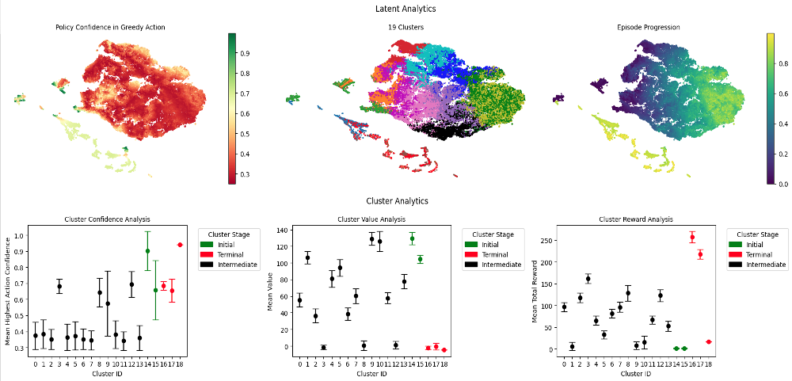
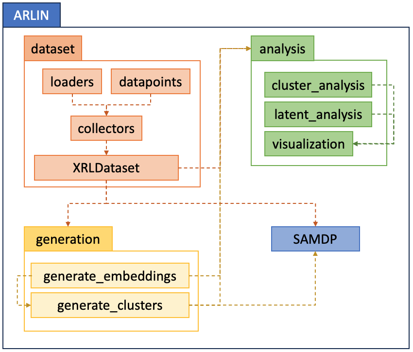

# ARLIN - Assured Reinforcement Learning Model Interrogation

ARLIN is a Python library that provides explainability outputs for trained Reinforcement
Learning (RL) models that can be used to identify potential policy vulnerabilities and
critical points. Using XRL datasets, ARLIN provides detailed analysis into an RL model’s
latent space, creates a semi-aggregated Markov decision process (SAMDP) to outline the
model’s path throughout an episode, and produces cluster analytics for each node within
the SAMDP to identify potential failure points and vulnerabilities within the model.

<p align="center">
  
</p>

**Table of Contents**

- [About ARLIN](#about-arlin)
- [Main Features](#main-features)
- [Installation](#installation)
- [Getting Started](#getting-started)
- [License](#license)
- [Citation](#citation)

# About ARLIN
The ARLIN Toolkit is a research library written in Python that provides explainability
outputs and vulnerability detection for Deep Reinforcement Learning (DRL) models,
specifically designed to increase model assurance and identify potential points of
failure within a trained model. ARLIN utilizes [matplotlib](https://matplotlib.org) and
[networkx](https://networkx.org) to visualize a trained RL model’s decision making
process and provide meaningful vulnerability identification and analysis to researchers.
The modular library is structured to easily support custom architecture, algorithm,
framework, and analytics modifications and provides a well-documented and tested API for
XRL research development and model assurance.

Key functionalities of the ARLIN library include:
- Creation of an XRL dataset with user-defined datapoints from a trained policy with the
ability to support custom data, algorithms, and model architectures.
- Dimensionality reduction and embedding generation of a trained model's latent space.
- Unsupervised clustering of policy latent space outputs based on policy transition data
and available XRL attributes.
- Analysis and visualization of policy latent space embeddings and clusters.
- Semi-aggregated Markov decision process (SAMDP) generation and policy-specific path
analysis.

# Main Features

<p align="center">
  
</p>

At a high-level, ARLIN has 4 main components: `dataset`, `generation`, `analysis`, and
`SAMDP`. The `dataset` component is used to create an XRL dataset from a trained model.
`generation` uses the XRL dataset to create embeddings and clusters, which `analysis`
provides meaningful analysis and visualizations of. The cluster data and XRL dataset can
also be provided to `SAMDP` to generate and visualize different SAMDP graphs of the
agent's policy along with available paths between given clusters.

# Installation

*Note: ARLIN has only been tested on Ubuntu 18.04 and Python 3.11.6

1. **Clone the repository**

    ```bash
    git clone https://gitlab.mitre.org/advxai/arlin.git
    ```

2. **Setup Pyenv Virtual Environment**

    ```bash
    curl https://pyenv.run | bash
    ```

    ```bash
    export PYENV_ROOT="$HOME/.pyenv"
    command -v pyenv >/dev/null || export PATH="$PYENV_ROOT/bin:$PATH"
    eval "$(pyenv init -)"
    ```

    ```bash
    pyenv install 3.11.6
    pyenv local 3.11.6
    ```

3. **Install poetry**

    ```bash
    curl -sSL https://install.python-poetry.org | python3 -
    ```

    *Note: Don't forget to add `poetry` to your path.*
    ```bash
    export PATH="$HOME/.local/bin:$PATH"
    ```

    ```bash
    poetry config virtualenvs.in-project true
    poetry env use 3.11.6
    ```

4. **Install required packages**

    ```bash
    cd arlin
    poetry shell
    poetry install --no-dev
    ```

    *Note: To re-enter the environment after this step, run `poetry shell`.*

# Getting Started

ARLIN provides a number of example usage notebooks within the [examples](./examples/)
directory. Documentation is available [here](TODO).

# License

ARLIN is released under the [Apache 2.0 license](LICENSE).

# Citation

If you use `ARLIN` for your work, please cite the following BibTex entry.

```BibTeX
@misc{tapley2023arlin,
  author =       {Alexander Tapley},
  title =        {ARLIN},
  howpublished = {\url{https://github.com/mitre/arlin}},
  year =         {2023}
}
```
